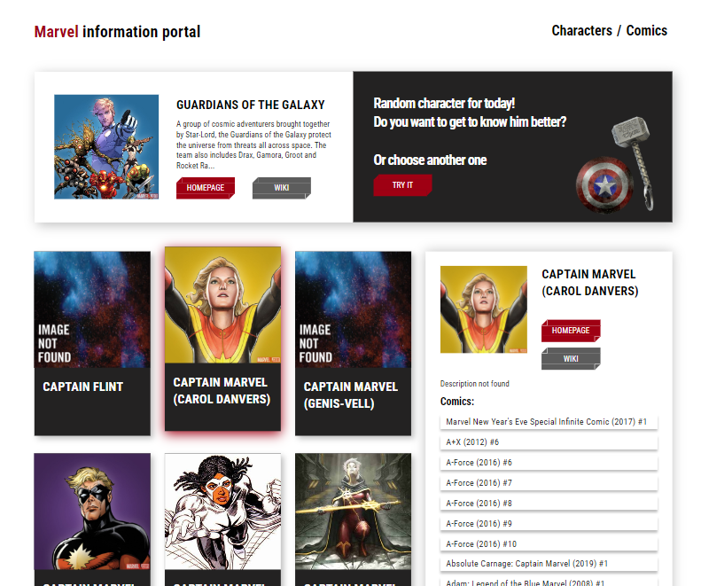

# Marvel information portal

### Description:

    Marvel Information Portal is a React-based web application developed as part of the React Developer course on Udemy.
    This portal serves as a comprehensive platform for exploring Marvel comics, featuring a range of functionalities that enhance the user experience.

### Key Features:

    * Random Comic Display: At the top of the main page, users are greeted with a dynamically generated random comic, providing an engaging and ever-changing introduction to the Marvel universe.

    * Marvel API Integration: Leveraging the Marvel API, the portal fetches and displays a complete list of comics available, offering users a vast catalog of Marvel stories to explore.

    * Character-Related Comics: Users can view a curated selection of comics associated with specific characters. This feature enables fans to discover comics that prominently feature their favorite superheroes or villains.

    * Detailed Comic Information: Clicking on any comic from the main page reveals detailed information, allowing users to delve into the specifics of each storyline, including characters involved, release dates, and other relevant details.

### Technologies Used:

    * React
    * React Hooks (useState, useEffect, useHttp, useCallback)
    * React Custom Hook (useMarvelServices)
    * Sass for styling
    * Marvel API

### How to Run the Project:

    Clone the repository from GitHub.
    Navigate to the project directory.
    Run npm install to install dependencies.
    Execute npm start to launch the application locally.
    Open your browser and visit the specified address to experience Marvel information portal

### App screenshot:

